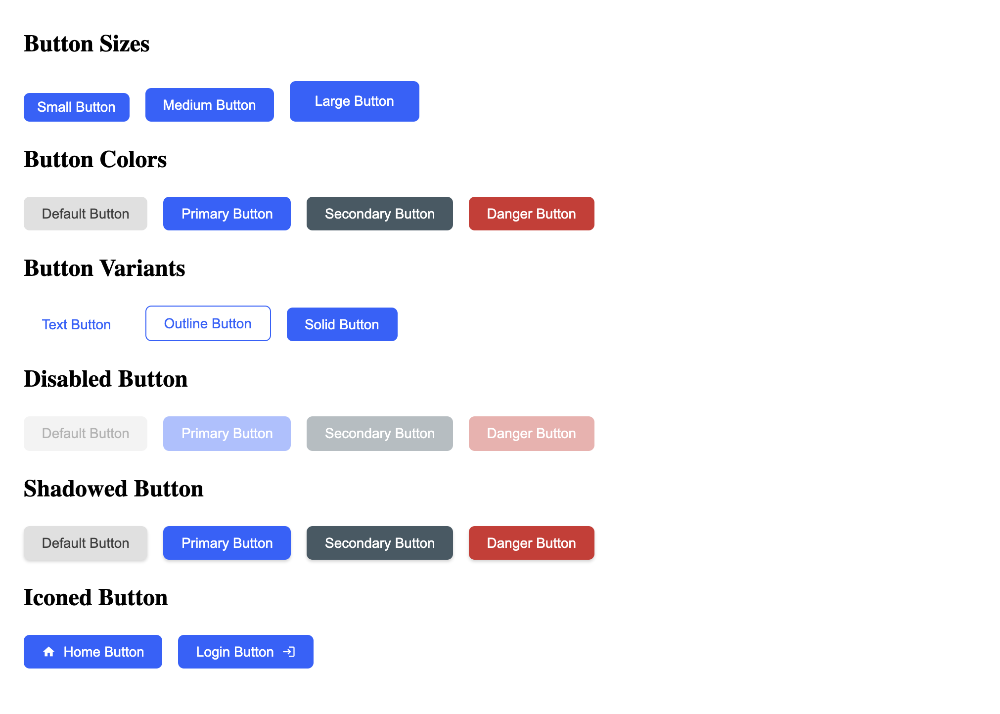

<!-- Please update value in the {}  -->

<h1 align="center">DevChallenged UI Components</h1>

<div align="center">
   Solution for a challenge from  <a href="http://devchallenges.io" target="_blank">Devchallenges.io</a>.
</div>

<div align="center">
  <h3>
    <a href="https://{your-url-to-the-solution}">
      Storybook
    </a>
    <span> | </span>
    <a href="https://devchallenges.io/challenges/ohgVTyJCbm5OZyTB2gNY">
      Challenge
    </a>
  </h3>
</div>

<!-- TABLE OF CONTENTS -->

## Table of Contents

- [Overview](#overview)
  - [Built With](#built-with)
- [Features](#features)
- [How to use](#how-to-use)
- [Acknowledgements](#acknowledgements)
- [Contact](#contact)

<!-- OVERVIEW -->

## Overview



This is the solution to the component challenges in devchallenge.

### The follow challenges are included
- Button Component

### Where to view the components
The components can be viewed through storybook.

### What I have learned:
- How to integrate Storybook into react component library.

### Built With

<!-- This section should list any major frameworks that you built your project using. Here are a few examples.-->

- [React](https://reactjs.org/)
## Features

<!-- List the features of your application or follow the template. Don't share the figma file here :) -->

This application/site was created as a submission to a [DevChallenges](https://devchallenges.io/challenges) challenge. The [challenge](https://devchallenges.io/challenges/ohgVTyJCbm5OZyTB2gNY) was to build an application to complete the given user stories.

## How To Use

<!-- This is an example, please update according to your application -->

To clone and run this application, you'll need [Git](https://git-scm.com) and [npm](http://npmjs.com) (which comes with [node](https://nodejs.org/en/download/)) or [yarn](https://yarnpkg.com/) installed on your computer. From your command line:

```bash
# Clone this repository
$ git clone https://github.com/ZakariaTalhami/components-devchallenge.git

# Install dependencies
$ yarn install
  # or
$ npm install 

# Run the app
$ yarn start
  # or
$ npm start 

```

## Acknowledgements

<!-- This section should list any articles or add-ons/plugins that helps you to complete the project. This is optional but it will help you in the future. For exmpale -->

- [React Storybook Crash Course](https://www.youtube.com/watch?v=FUKpWgRyPlU&t=921s)
- Theming inspired from [Chakra-UI](https://chakra-ui.com/).

## Contact

- GitHub [@ZakariaTalhami](https://github.com/ZakariaTalhami)
- Twitter [@ZTalhami](https://twitter.com/Ztalhami)
